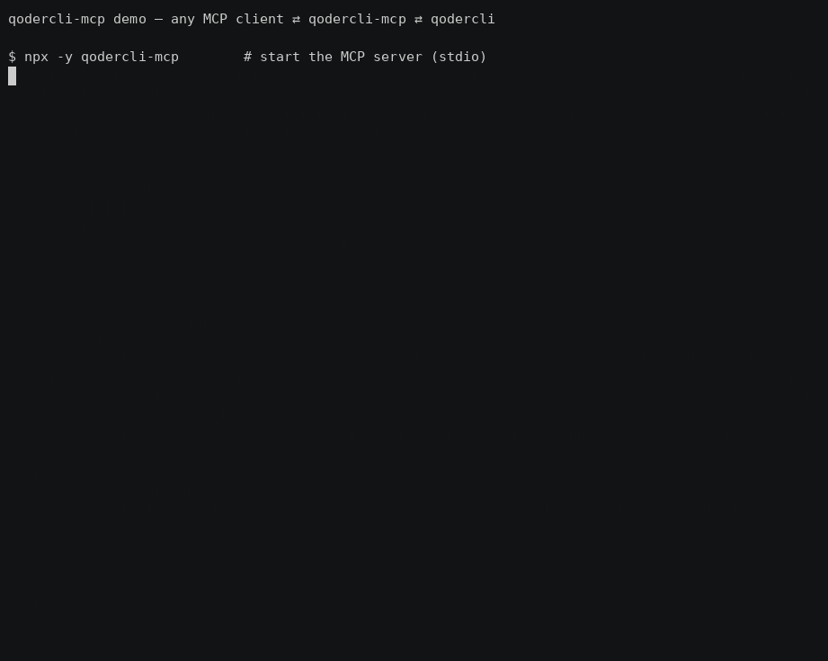

# qodercli-mcp

[](https://www.npmjs.com/package/qodercli-mcp)
[](https://www.npmjs.com/package/qodercli-mcp)
[](./LICENSE)
[](https://github.com/cantbeblank96/qodercli-mcp)

> **The missing MCP server mode for Qoder CLI** — delegate coding tasks to local Qoder agents from any MCP client (Qoder IDE, Claude Code, Cursor…).
>
> **给 Qoder CLI 补上 MCP server 模式**：让任意 MCP 客户端把任务委托给本地 Qoder Agent。

一个极简的 MCP server，把本地的 qodercli（Qoder CLI）包装成 MCP 工具，让任意 MCP 客户端（Qoder IDE、Claude Code、Cursor 等）可以像调用子 Agent 一样调用 Qoder。



*30s demo: MCP client ⇄ qodercli-mcp ⇄ qodercli — initialize → tools/list → list-models（真实输出，非加速）*

## Quick start / 快速开始

Zero-config via npx — add this to your MCP client config (`~/.qoder/mcp.json`, `claude_desktop_config.json`, …):
零配置：把下面这段加进你的 MCP 客户端配置即可：

```json
{ "mcpServers": { "qodercli-mcp": { "command": "npx", "args": ["-y", "qodercli-mcp"] } } }
```

Three tools are exposed / 提供三个工具：

| Tool | Purpose / 用途 |
|---|---|
| `ask-qoder` | Delegate a task to qodercli / 委托任务给 qodercli |
| `list-sessions` | Discover resumable sessions / 发现可续接的历史会话 |
| `list-models` | Runtime model discovery / 运行时查询可用模型 |

Highlights / 亮点：**verified permission semantics** (see below — e.g. `dont_ask` is read-only)
实测权限语义文档化 · codex 风格 `sandbox`/`approval_policy` · 结构化输出（session_id/duration_ms/total_credits）。

Full configuration options are in [Install](#install--安装) / 完整配置见下方 [安装](#install--安装)。

## Why / 为什么

Some CLI agents ship an official MCP server mode (e.g. `codex mcp-server`), but `qodercli` currently only acts as an MCP **client**. This project fills that gap with a thin wrapper: it spawns `qodercli -p <prompt>` under the hood and streams the result back over MCP stdio.

部分 CLI Agent 自带官方 MCP server 模式（如 `codex mcp-server`），但 qodercli 目前只能作为 MCP **客户端**。本项目用一个薄包装层补上这个缺口：内部调用 `qodercli -p <prompt>`，把结果通过 MCP stdio 返回。

## Features / 功能

- `ask-qoder` tool — delegate a prompt to qodercli
- `ask-qoder` 工具 —— 把任务委托给 qodercli
- Structured output (`session_id`, `is_error`, `duration_ms`, `total_credits`, `num_turns`) via `-o json` parsing
- 结构化输出（`session_id`、`is_error`、`duration_ms`、`total_credits`、`num_turns`），自动解析 `-o json`
- `list-sessions` tool to discover resumable sessions
- `list-sessions` 工具，用于发现可续接的会话
- `list-models` tool for runtime model discovery (no stale model lists)
- `list-models` 工具，运行时发现可用模型（不依赖过时清单）
- `reasoning_effort` parameter (`--reasoning-effort`)
- `reasoning_effort` 参数（透传 `--reasoning-effort`）
- Server `instructions` in the MCP initialize result guide clients on usage
- MCP initialize 结果携带服务器使用说明，引导客户端正确调用
- Codex-style `sandbox` levels (`read-only` / `workspace-write` / `danger-full-access`)
- 仿 codex 的 `sandbox` 分级（`read-only` / `workspace-write` / `danger-full-access`）
- System prompt injection (`system_prompt` / `append_system_prompt`)
- 系统提示注入（`system_prompt` / `append_system_prompt`）
- Working directory, model, permission mode, output format control
- 支持指定工作目录、模型、权限模式、输出格式
- Session resume (`resume_session_id`) for multi-turn delegation
- 支持会话续接（`resume_session_id`），可多轮委托
- Timeout protection with SIGKILL fallback
- 超时保护（超时自动 SIGKILL）
- Proxy quota support (`HTTP_PROXY` / `HTTPS_PROXY` injection)
- 代理额度支持（`HTTP_PROXY` / `HTTPS_PROXY` 注入）
- Zero build step — plain ESM JavaScript, Node.js >= 18
- 无需构建 —— 纯 ESM JavaScript，Node.js >= 18

## Prerequisites / 前置条件

1. Node.js >= 18
2. `qodercli` installed and signed in (`qodercli login`)

## Install / 安装

**Option A — npx (recommended / 推荐)**: no clone needed, the MCP client downloads the package on first use.
无需克隆，MCP 客户端首次使用时自动下载：

```json
"command": "npx", "args": ["-y", "qodercli-mcp"]
```

**Option B — from source (for development / 开发用)**:

```bash
git clone https://github.com/cantbeblank96/qodercli-mcp.git
cd qodercli-mcp
npm install
```

## MCP client configuration / MCP 客户端配置

### Qoder IDE

Add to `~/.qoder/mcp.json`. Prefer the absolute path of `node` and set `QODERCLI_PATH` explicitly (nvm-managed binaries are often missing from the PATH seen by MCP child processes):

> **Proxy Support**: To use your Qoder CLI proxy quota, add `HTTP_PROXY` and/or `HTTPS_PROXY` to the server's environment. When these are set at the MCP server level, they will be passed to all qodercli subprocesses.

添加到 `~/.qoder/mcp.json`。建议使用 `node` 的绝对路径并显式设置 `QODERCLI_PATH`（MCP 子进程的 PATH 中经常缺少 nvm 管理的二进制目录）：

> **代理支持**：要使用 Qoder CLI 代理额度，可在服务器的环境变量中添加 `HTTP_PROXY` 和/或 `HTTPS_PROXY`。当这些变量在 MCP 服务器级别设置时，它们会被传递到所有 qodercli 子进程。

```json
{
  "mcpServers": {
    "qodercli-mcp": {
      "command": "npx",
      "args": ["-y", "qodercli-mcp"],
      "env": {
        "QODERCLI_PATH": "/absolute/path/to/qodercli",
        "PATH": "/usr/local/bin:/usr/bin:/bin"
      }
    },
    "qodercli-mcp-with-proxy": {
      "command": "npx",
      "args": ["-y", "qodercli-mcp"],
      "env": {
        "QODERCLI_PATH": "/absolute/path/to/qodercli",
        "HTTP_PROXY": "http://127.0.0.1:39900",
        "HTTPS_PROXY": "http://127.0.0.1:39900",
        "PATH": "/usr/local/bin:/usr/bin:/bin"
      }
    }
  }
}
```

Developers running a local checkout instead of the published package (Option B) should replace `command`/`args` with the absolute `node` path and `/path/to/qodercli-mcp/src/index.js` (nvm-managed `node` is often missing from the PATH seen by MCP child processes).
使用本地源码（方式 B）的开发者请将 `command`/`args` 换成 `node` 绝对路径与 `/path/to/qodercli-mcp/src/index.js`（MCP 子进程的 PATH 中经常缺少 nvm 管理的二进制目录）。

### Claude Code / Claude Desktop

```json
{
  "mcpServers": {
    "qodercli-mcp": {
      "command": "node",
      "args": ["/absolute/path/to/qodercli-mcp/src/index.js"],
      "env": {
        "QODERCLI_PATH": "/absolute/path/to/qodercli"
      }
    }
  }
}
```

## Tool: `ask-qoder`

| Parameter | Type | Description |
|---|---|---|
| `prompt` | string (required) | The task or question for qodercli / 交给 qodercli 的任务或问题 |
| `cwd` | string | Working directory / 工作目录 |
| `model` | string | Model for this session; call `list-models` to discover available names / 本次会话使用的模型，先用 `list-models` 查询 |
| `reasoning_effort` | string | Reasoning effort level (`--reasoning-effort`), e.g. `low`/`medium`/`high`; depends on the model / 推理强度，取决于模型 |
| `permission_mode` | enum | `dont_ask` (default, **read-only**) \| `accept_edits` (auto-approve file edits) \| `bypass_permissions` (full access incl. shell) \| `auto` \| `default`; mutually exclusive with `approval_policy`, prefer `sandbox` / 与 `approval_policy` 互斥，推荐用 `sandbox` |
| `approval_policy` | enum | codex-style: `untrusted`→read-only \| `on-request`→auto \| `never`→full access / 仿 codex 审批策略，自动映射 |
| `sandbox` | enum | `read-only` \| `workspace-write` \| `danger-full-access` (codex-style; controls the effective permission mode) / 控制实际权限级别 |
| `system_prompt` | string | Replace the default system prompt / 替换默认系统提示 |
| `append_system_prompt` | string | Append instructions to the default system prompt / 追加系统提示 |
| `resume_session_id` | string | Resume a previous session / 续接之前的会话 |
| `output_format` | string | Passed to `-o` (default `json`) / 透传给 `-o`（默认 `json`）。Note: non-json formats degrade structured output (`session_id` etc. become unavailable) / 非 json 格式会使结构化字段失效 |
| `extra_args` | string[] | Raw CLI args appended before the prompt; reserved flags (permission mode, system prompt, model, `-o`, `-r`, `-w`...) are rejected / 追加原始 CLI 参数；保留 flag 会被拒绝 |
| `timeout_ms` | number | Timeout in ms, default 600000 / 超时毫秒数，默认 600000 |

### Structured output / 结构化输出

`ask-qoder` declares an MCP `outputSchema` and returns, in addition to the
human-readable text, a `structuredContent` object:

`ask-qoder` 声明了 MCP `outputSchema`，除可读文本外还返回 `structuredContent` 对象：

```json
{
  "session_id": "77826b5c-...",   // pass back as resume_session_id / 回传用于续接
  "content": "OK",
  "is_error": false,
  "exit_code": 0,
  "duration_ms": 1280,
  "total_credits": 0.53,
  "num_turns": 1,
  "timed_out": false,
  "truncated": false
}
```

### Sandbox mapping / 沙箱映射

| sandbox | Effective permission mode / 实际权限模式 | Effect on qodercli / 对 qodercli 的效果 |
|---|---|---|
| (omitted / 缺省) | `dont_ask` | Read-only: permission-requiring tools are silently denied / 只读：需授权的工具调用被静默拒绝 |
| `read-only` | `dont_ask` | Plus `--disallowed-tools write_file,replace,run_shell_command` as defense in depth / 额外禁用写/shell 工具，双保险 |
| `workspace-write` | `accept_edits` | Agent can create/modify files in `cwd` / 可在 `cwd` 创建/修改文件 |
| `danger-full-access` | `bypass_permissions` | Full access including shell / 完全权限（含 shell） |

Explicit `permission_mode` or `approval_policy` always wins over `sandbox`.
显式设置的 `permission_mode` / `approval_policy` 优先于 `sandbox`。

### Permission modes (verified semantics) / 权限模式（实测语义）

| Mode | Behavior / 行为 |
|---|---|
| `dont_ask` | **Read-only**: silently denies every tool call that requires permission. Headless-safe default / 只读：静默拒绝一切需授权的工具调用；无头安全默认值 |
| `accept_edits` | Auto-approves file edits; shell still governed by policy / 自动批准文件编辑 |
| `bypass_permissions` | Auto-approves everything including shell / 全部自动批准（含 shell） |
| `auto` | qodercli's own automatic policy / qodercli 自动策略 |
| `default` | Interactive confirmation — not headless-friendly, avoid in MCP calls / 交互式确认，无头调用中应避免 |

## Tool: `list-sessions`

Lists local qodercli sessions (index, summary, session id) so a client can
pick a `resume_session_id`. Takes no arguments.

列出本地 qodercli 会话（序号、摘要、会话 ID），便于挑选 `resume_session_id`。无参数。

## Tool: `list-models`

Lists models currently supported by qodercli (via `--list-models`), so a
client can pick a valid `model` value at runtime instead of relying on
stale knowledge. Returns both a text list and a structured `models` array.
Takes no arguments.

列出 qodercli 当前支持的模型，供运行时选择有效的 `model` 值（不依赖过时知识）。返回文本清单和结构化 `models` 数组。无参数。

### Usage Examples / 使用示例

#### Example 1: Simple code explanation / 简单代码解释
```javascript
{ "name": "ask-qoder", "arguments": { 
  "prompt": "Explain what main.py does",
  "cwd": "/path/to/project",
  "timeout_ms": 180000 
}}
```
结果会返回一段自然语言解释，帮助理解文件功能。

#### Example 2: Ask a second opinion / 获取第二意见
```javascript
{ "name": "ask-qoder", "arguments": { 
  "prompt": "@src/service.py Review this file for security issues and suggest improvements",
  "model": "qwen-plus",
  "permission_mode": "dont_ask",
  "timeout_ms": 300000 
}}
```
Qoder 会给出安全建议和改进方案。

#### Example 3: Multi-turn conversation via resume / 多轮对话续接
```javascript
// First call — session_id comes back in structuredContent
// 首次调用 —— session_id 会在 structuredContent 中返回
{ "name": "ask-qoder", "arguments": {
  "prompt": "Help me refactor this module to improve readability",
  "cwd": "/projects/backend",
  "timeout_ms": 300000 
}}
// Then reuse structuredContent.session_id:
// 然后把 structuredContent.session_id 回传：
{ "name": "ask-qoder", "arguments": {
  "prompt": "Now add error handling for database timeouts",
  "resume_session_id": "77826b5c-cd6b-4213-b423-d95b4e1deab0"
}}
// Or discover ids with list-sessions / 或用 list-sessions 查找历史会话 ID
{ "name": "list-sessions", "arguments": {} }
```
通过 `resume_session_id` 可实现多轮交互式迭代优化。

#### Example 4: Code review with specific focus / 针对性代码审查
```javascript
{ "name": "ask-qoder", "arguments": {
  "prompt": "Analyze performance bottlenecks in utils.py",
  "model": "qwen-max",
  "permission_mode": "default",
  "output_format": "text",
  "timeout_ms": 240000 
}}
```
适合性能分析和优化建议场景。

#### Example 5: Read-only analysis / 只读分析
```javascript
{ "name": "ask-qoder", "arguments": {
  "prompt": "Audit this codebase for security issues; do not modify anything",
  "cwd": "/workspaces/repo",
  "sandbox": "read-only",
  "timeout_ms": 300000 
}}
```
`read-only` 会禁用写文件与 shell 工具，适合审计/评审场景。

#### Example 6: Project-wide analysis / 项目范围分析
```javascript
{ "name": "ask-qoder", "arguments": {
  "prompt": "Summarize the architecture of this project and identify key modules",
  "cwd": "/workspaces/repo",
  "timeout_ms": 420000,
  "model": "qwen-plus"
}}
```
适用于大型项目快速梳理和架构理解。

### Best Practices / 最佳实践

1. **Specify working directory** — Always pass `cwd` when operating on a specific project
   操作特定项目时务必指定 `cwd`
2. **Use timeout protection** — For complex prompts, set explicit `timeout_ms` shorter than 60min
   复杂任务设置 `timeout_ms`（建议 5–10 分钟），避免挂起
3. **Resume for multi-turn** — Chain follow-ups via `resume_session_id` instead of repeating context
   后续追问用 `resume_session_id` 续接会话，避免重复上下文
4. **Model selection** — Call `list-models` first to discover currently supported models; larger models are better for deep analysis
   先调 `list-models` 查询当前可用模型；深度分析建议选择大模型
5. **Permission mode** — The server default is read-only (`dont_ask`); set `QODERCLI_DEFAULT_PERMISSION_MODE=bypass_permissions` to make full (YOLO) access the default for personal deployments. Per-call: tasks that must create/modify files need `sandbox: "workspace-write"`; shell access needs `danger-full-access`. Do not combine `sandbox` with an explicit `permission_mode` (the latter wins)
   服务器默认只读（`dont_ask`）；个人部署可用 `QODERCLI_DEFAULT_PERMISSION_MODE=bypass_permissions` 将全开（YOLO）设为默认。单次调用：需要改文件设 `sandbox: "workspace-write"`，需要 shell 用 `danger-full-access`；勿与显式 `permission_mode` 混用（后者优先生效）

## Environment variables / 环境变量

| Variable | Default | Description |
|---|---|---|
| `QODERCLI_PATH` | `qodercli` | Path to the qodercli binary / qodercli 二进制路径 |
| `QODERCLI_TIMEOUT_MS` | `600000` | Default timeout / 默认超时 |
| `QODERCLI_MAX_OUTPUT_MB` | `50` | Per-call stdout/stderr cap in MB (OOM protection) / 单次调用输出上限（MB，防 OOM） |
| `QODERCLI_DEFAULT_PERMISSION_MODE` | `dont_ask` | Default permission mode when the caller omits permission_mode/approval_policy/sandbox; set `bypass_permissions` for full (YOLO) access / 调用方未指定权限参数时的默认模式；设 `bypass_permissions` 即全开（YOLO） |
| `HTTP_PROXY` | - | HTTP proxy URL for qodercli / qodercli 的 HTTP 代理地址 |
| `HTTPS_PROXY` | - | HTTPS proxy URL for qodercli / qodercli 的 HTTPS 代理地址 |

## Development / 开发

```bash
npm test        # smoke test: protocol handshake + tool invocation
node src/index.js   # run the server manually (stdio)
```

## Disclaimer / 免责声明

This is an unofficial, third-party tool. It is not affiliated with, endorsed, or sponsored by Qoder. Use `permission_mode: bypass_permissions` with care — delegated prompts may modify files in the target working directory.

本项目为非官方第三方工具，与 Qoder 官方无关。请谨慎使用 `bypass_permissions` 权限模式——委托的任务可能修改目标工作目录中的文件。

## License

MIT
